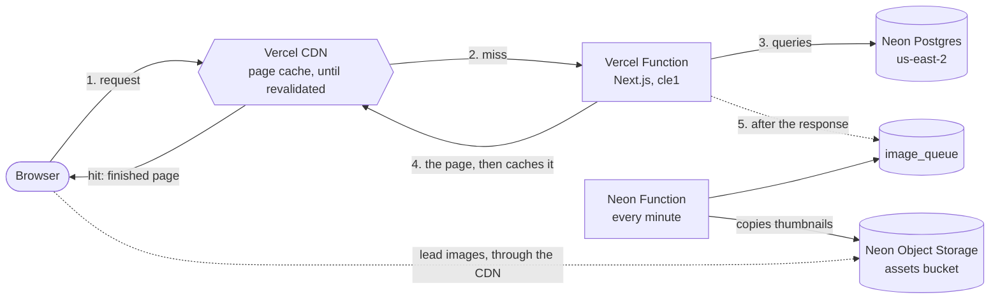

# Wikipedia on Neon

All 6,407,814 articles of English Wikipedia (the 1 November 2023 dump), served live from [Neon Postgres](https://neon.com) in a UI that mirrors Wikipedia's Vector 2022 skin.

## How a request is served

The homepage and article pages cache their full render with `use cache` and a `forever` profile ([`next.config.ts`](next.config.ts)), which Vercel serves from its CDN as ISR until the page is revalidated. An article's first visit renders on a Vercel Function in `cle1`, next to the Neon compute in `us-east-2`. Later visits get plain HTML from the cache with no queries. Search, suggestions, Special:Random and the results under a missing title always query Neon. No page streams, so metadata stays in the `<head>`.



| Step     | Main Page `/`                                                              | Search `/wiki/Special:Search?search=…`                                                | Article `/wiki/<title>`                                                                                                                                       |
| -------- | -------------------------------------------------------------------------- | ------------------------------------------------------------------------------------- | ------------------------------------------------------------------------------------------------------------------------------------------------------------- |
| CDN      | Prerendered at build, refreshed every 12 hours by cron.                    | Never cached.                                                                         | Cached after the first visit.                                                                                                                                 |
| Function | Renders on the first visit after a revalidation.                           | An exact title redirects to the article ("Go"). Otherwise renders the first results.  | Renders on a miss. A differently cased title caches as a meta refresh to the stored title.                                                                    |
| Neon     | Five parallel queries: count, featured, did you know, random, on this day. | Exact-title check, then query analysis, BM25 results and the exact count in parallel. | Article, neighbours and stored spelling in one round trip, then the "See also" link check. A missing title fetches results from `/api/search` in the browser. |

After responding, every route queues the lead images it showed that are not yet in Object Storage.

Other routes: Special:Random redirects to a random article. Social cards (`/og.png`, `/og/<title>`) are cached for a day. Lead image copies load through `/assets/thumbs/<hash>/250`, which the CDN caches for a year.

### Revalidation

`POST /api/revalidate` refreshes one exact path, encoded (`/wiki/AT%26T`) or decoded (`/wiki/AT&T`). Other spellings of a title are separate paths, as are `/` and `/wiki/Main_Page`. Route patterns are refused.

```bash
curl -X POST -H "Authorization: Bearer $REVALIDATE_SECRET" -H "Content-Type: application/json" \
  -d '{"path": "/wiki/Albert_Einstein"}' https://wikifaster.vercel.app/api/revalidate
```

A [Vercel Cron Job](https://vercel.com/docs/cron-jobs) in [`vercel.json`](vercel.json) calls `/api/cron/main-page` every 12 hours to refresh `/` and `/wiki/Main_Page` with new picks.

## Design notes

- **[Next.js 16](https://nextjs.org) with [Cache Components](https://nextjs.org/docs/app/getting-started/caching).** No page has a Suspense boundary (`instant = false`), so each is sent whole with its content in the first paint. A streamed boundary over 12.8 KB would otherwise hold its reveal until 300 ms after the placeholder paints.
- **[Drizzle](https://orm.drizzle.team) on `@neondatabase/serverless`** (SQL over HTTP) from [`src/db/index.ts`](src/db/index.ts). Components query `db` directly. Search uses `db.batch` to run `set_config(…, true)` ahead of its queries, which pins planner settings and timeouts for that transaction.
- **[shadcn/ui](https://ui.shadcn.com) (Base UI) themed to Wikipedia's Codex palette** in [`src/tokens.css`](src/tokens.css). The Appearance menu and pinnable Contents and Appearance panels behave like Vector's, with the same 1120px breakpoint.
- **Articles are plain text.** [`src/lib/wikitext.ts`](src/lib/wikitext.ts) rebuilds sections, the table of contents and categories from the dump's lines. "See also" and disambiguation entries link blue or red depending on whether the article exists.
- **Lead images come from Wikipedia's `page_props` dump**, keyed by page ID, which matches `articles.id`. Each links to its Wikipedia file page for credit. [`lead-image.tsx`](src/components/lead-image.tsx) shimmers until the image loads, and on screens under 640px fills a fixed 4:5 frame so the text never shifts.
- **Images are copied into Neon Object Storage.** A [Function Trigger](https://neon.com/docs/compute/functions/triggers/overview) runs [`functions/images.ts`](functions/images.ts) every minute to drain `image_queue`, viewed articles first, then a backfill by article size. It copies 250px thumbnails into the public `assets` bucket at the 2 concurrent downloads Wikimedia's [Robot policy](https://wikitech.wikimedia.org/wiki/Robot_policy) allows (about 550 files a minute). It waits out 429s, drops files that return 404 or 410, and retries other failures up to 5 times. Until an image is copied, pages load it from Wikimedia.
- **Every page shows its query time.** The timing bar under the tabs shows time spent on Neon, round trips included. `/api/search` and `/api/suggest` also send it as `Server-Timing`.
- **Interactive UI loads on first use.** The search combobox, main menu and popovers render as plain HTML and load their code on first hover, focus or click ([`useLazyOpen`](src/components/lazy-open.tsx), [`SearchField`](src/components/search-field.tsx)).
- **No debounce.** Suggestions and results query on every keystroke, and each request aborts the one before it.

### Search

| Query                                    | Index                                                  | How                                                                     |
| ---------------------------------------- | ------------------------------------------------------ | ----------------------------------------------------------------------- |
| Exact title, wrong case                  | `articles_title_key`, `lower(title)`                   | Direct lookup, redirecting to the stored spelling.                      |
| Suggestions, 1-2 character queries       | `articles_title_prefix_idx` (`text_pattern_ops`)       | Prefix walk, exact match first, then longest articles.                  |
| Substrings, misspellings, stopwords only | `articles_title_trgm_idx` (trigram GIN)                | `LIKE '%…%'`, then trigram similarity.                                  |
| Full text, ranked                        | `articles_search_bm25` (`lakebase_bm25`)               | Top BM25 candidates that match every word.                              |
| Rare ANDs, phrases, exact counts         | `articles_search_gin` (GIN)                            | Collects all matches when BM25 falls short, and counts via bitmap scan. |
| Typos ("einstien")                       | `search_terms` lexicon (trigram GIN + `fuzzystrmatch`) | Up to 3 edits, only toward much more common words.                      |

Both full-text indexes are on the expression `to_tsvector('english', title || ' ' || text)`, so the 15 GB table was never rewritten. Counts for phrases and negations are exact if they finish within 1.5s, otherwise shown as "about N".

### Gaps in the dump

The Hugging Face export (`wikimedia/wikipedia`, `20231101.en`) leaves out date and year articles and some major ones such as London, Paris and World War II. "On this day" falls back to the day's Eastern Orthodox liturgical calendar page.

## Local dev

Needs Python 3 with `pyarrow`, `huggingface_hub` and `psycopg` in `./venv`.

```bash
npm install
cp .env.example .env   # set DATABASE_URL_UNPOOLED
npm run db:download    # 11.6 GB of Parquet into ./data
npm run db:ingest      # parallel COPY into Postgres, resumable
npm run db:migrate     # extensions, tables, BM25 and GIN indexes (slow)
npm run db:lexicon     # typo lexicon from article titles
npm run db:images      # lead images from the page_props dump (about 470 MB)
npm run db:prewarm     # optional: load every index into the compute's cache
npm run dev
```

To copy images into Object Storage, deploy the bucket, function and trigger declared in [`neon.ts`](neon.ts). To backfill all 2.2M images instead of only viewed ones (a few days), queue them once and track progress with `SELECT count(stored), count(*) FROM article_images`:

```bash
neon deploy --project-id <project> --branch <branch> --no-env-pull
npm run db:images -- --queue-all
```

Also available: `npm run typecheck`, `npm run format`, and `npm run db:generate` (a drizzle-kit migration from [`src/db/schema.ts`](src/db/schema.ts)).

## Deployment

Deploy on Vercel in `cle1`, next to the Neon compute in `us-east-2`.

| Variable                | Purpose                                                                                                                |
| ----------------------- | ---------------------------------------------------------------------------------------------------------------------- |
| `DATABASE_URL_UNPOOLED` | Direct Neon connection string.                                                                                         |
| `AWS_ENDPOINT_URL_S3`   | Branch storage endpoint, read at build so pages use the bucket's image copies. Without it, images load from Wikimedia. |
| `REVALIDATE_SECRET`     | Bearer token for `/api/revalidate` (`openssl rand -hex 32`). Without it, every request is refused.                     |
| `CRON_SECRET`           | Sent by Vercel Cron to `/api/cron/main-page`. Cron runs on production deployments only.                                |

Text and images are from Wikipedia and Wikimedia Commons. Text is under [CC BY-SA 4.0](https://creativecommons.org/licenses/by-sa/4.0/). This is an unofficial mirror, not affiliated with the Wikimedia Foundation.
